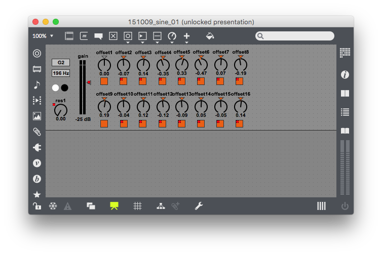
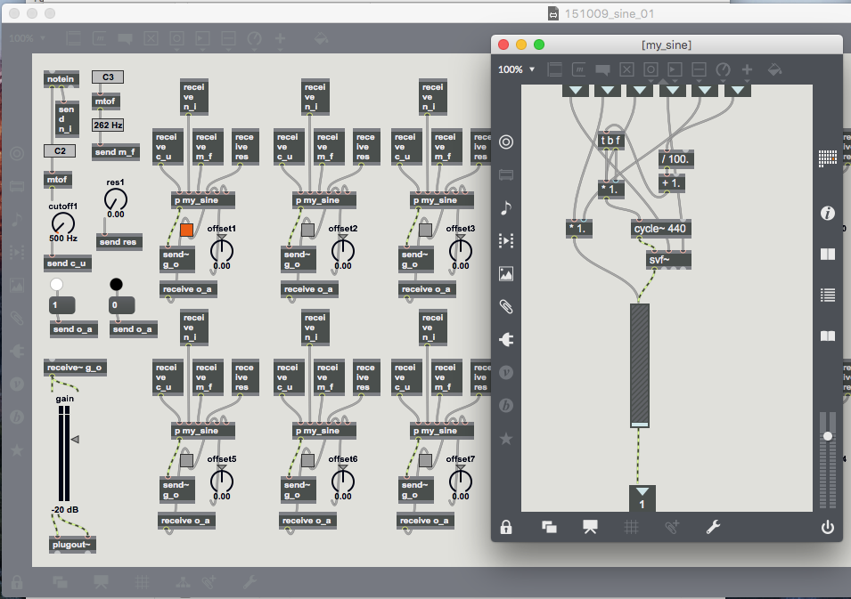
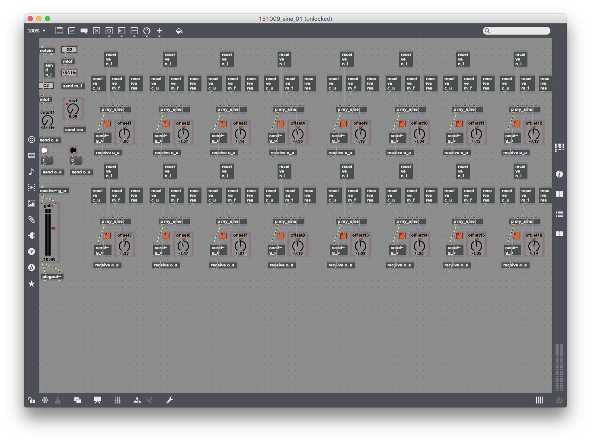

# Simultaneous Sine Waves 
### Ableton Live sound design instrument  

* * *

This an Max4Live instrument for Ableton Live.  
It generates multiple sine waves simultaneously and can used a sound a waves “beating” against each other.
  
I have created this for my own sound design experiments to have easy access to Ableton's filter parameters (cut-off frequency and resonance).  

A demo mp3 file is included. Drums sounds are added on top.

----
    
  
[More sound experiments](https://anderspedersen.bandcamp.com/album/algorithms-field-recordings-and-synth-programming)
